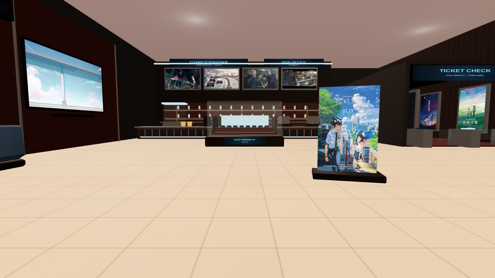
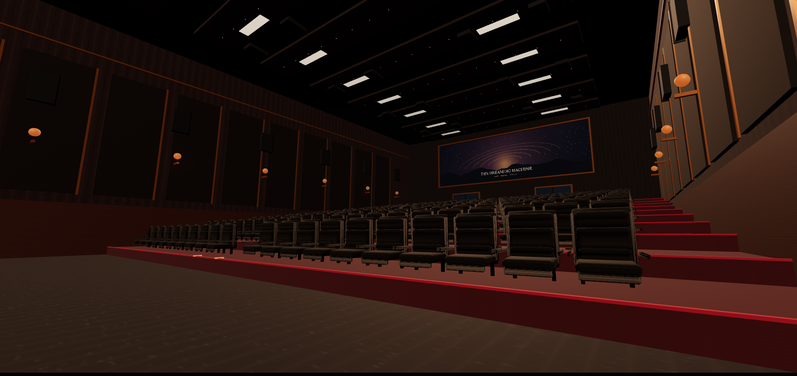

# VELVET 07：可配置的第一人称虚拟电影院

VELVET 07 是一个完全运行在浏览器中的第一人称 3D 电影院。它不把传统网页面板盖在画面上，而是把取票机、电影票、影片传输机和影厅遥控器都做成场景内交互物件，让大厅、走廊、座位和放映过程保持同一套沉浸式语言。

当前仓库同时包含一套完整的 VELVET 07 演示主题：城市夜景外厅、售票与卖品柜台、五块循环预告屏、空间化大厅音乐、可取出的电影票、声闸走廊、180 个可交互座位、超宽银幕以及影院化电影声场。影院名称、建筑文字、海报、立体海报、游戏画面、后墙壁画、预告片、背景音乐和票务信息都可以通过 JSON 与媒体文件替换，无需改 Three.js 建模代码。

> 推荐使用桌面版 Chrome 或 Edge，并佩戴耳机体验空间声场。浏览器会在第一次点击画面后解锁鼠标和音频。

## 主要体验

- 第一人称步行：鼠标环顾，`W A S D` 或方向键移动，自动适配台阶高度。
- 真实坐下与起身：从座椅正面靠近后坐下，视角会平滑转向；坐着按任意移动键即可起身。
- 大厅可坐座椅：限制在合理的转头范围，避免坐着原地旋转 360°。
- 自助取票：在取票机中选择影片并打印一次性电影票，日期和出票时间来自浏览器当前时间。
- 第一人称票面：票据位于视野最前层；大厅内按 `R` 放大，按 `H` 隐藏，进入或离开影厅后自动清除。
- 本地影片放映：从银幕下的传输机或遥控器选择本地视频。文件只通过浏览器对象 URL 播放，不上传到服务器。
- 完整画幅：影片按原始宽高比显示，比例不同时自动使用黑边，不通过裁切填满银幕。
- 影院声场：电影声音经过前方定位、低频增强、动态压缩、侧后方反射和短混响处理。
- 大厅声景：五块电视可同时播放带声音的预告；背景音乐由四个顶部扬声器定位，并带有大厅混响。
- 声闸过渡：从大厅进入影厅时，外部声音逐渐衰减并被低通，不会在门口突然截断，也不会干扰正片。
- 放映性能隔离：进入影厅后停止大厅媒体更新和相关场景负载，把解码与渲染预算留给正片。
- 可调影院大灯：支持渐亮、渐暗，并保留关灯后的台阶引导光与基础可见度。
- 城市夜景：玻璃幕墙外为完整的程序化夜景建模、星空与流星，而不是一张穿入影厅的平面贴图。

## 场景预览

首图展示大厅、外景与票务区。下面是影厅全景：



## 技术栈

- [Three.js](https://threejs.org/)：三维场景、材质、纹理、相机与射线交互。
- [Web Audio API](https://developer.mozilla.org/docs/Web/API/Web_Audio_API)：电影与大厅的 HRTF 定位、滤波、动态处理和混响。
- [Vite](https://vite.dev/)：开发服务器与生产构建。
- Canvas 2D：动态生成取票机界面、电影票、遥控器、招牌和部分动态屏幕纹理。

项目没有后端、数据库、账号系统或遥测服务。

## 快速开始

### 运行要求

- Node.js `^20.19.0` 或 `>=22.12.0`；
- npm；
- 支持 WebGL 2、Pointer Lock 与 Web Audio 的现代桌面浏览器；
- 可选：FFmpeg，用于压缩你自己的大厅预告片。

### 安装与启动

```bash
git clone https://github.com/seashapeland/cinema-vr.git
cd cinema-vr
npm install
npm run dev
```

打开终端显示的本地地址，通常是 `http://localhost:5173`。单击画面进入第一人称模式。

如果只需要在本机访问，也可以让 Vite 只监听本机地址：

```bash
npx vite
```

### 生产构建

```bash
npm run build
npm run preview
```

构建结果位于 `dist/`。部署时应把该目录作为站点根目录；项目媒体使用 `/lobby-media/...` 绝对路径，因此默认适合域名根路径部署。如果部署到某个子路径，请同时调整 Vite 的 `base` 和配置文件中的媒体 URL。

## 操作说明

| 操作 | 按键或方式 | 说明 |
| --- | --- | --- |
| 进入体验 | 单击画面 | 锁定鼠标并解锁浏览器音频 |
| 环顾 | 移动鼠标 | 第一人称视角 |
| 行走 | `W A S D` / 方向键 | 自动上下台阶 |
| 加速 | `Shift` | 步行加速 |
| 交互 | 注视物件后按 `E` 或单击 | 座椅、取票机、影片传输机 |
| 起身 | 坐着时按任一移动键 | 自动执行起身过渡 |
| 大厅电影票 | `R` | 放大或放回票据 |
| 大厅电影票 | `H` | 完全隐藏或重新拿出票据 |
| 退出取票界面 | `Esc` / `E` | 回到大厅视角 |
| 影厅遥控器 | `R` | 抬起或放回右下方遥控器 |
| 影厅遥控器 | `H` | 完全隐藏或恢复遥控器 |
| 大灯 | `L` | 切换影厅主照明，也可点遥控器 `LIGHT` |
| 播放 / 暂停 | `Space` | 也可点遥控器 `PLAY` |
| 停止 | `X` | 回到片头并暂停 |
| 选择片源 | `U` | 打开本地视频选择器 |

遥控器和取票机被抬起时会临时释放 Pointer Lock，方便使用鼠标点击场景内按钮。选择本地影片后，浏览器可能需要再次单击画面才能恢复锁定。

## 自定义你的电影院

绝大部分主题内容集中在两个文件中：

- `public/lobby-media/config.json`：影院品牌、建筑文字、海报、预告片、音乐、游戏画面和影厅文字；
- `public/lobby-media/ticketing.json`：电影票影片、场次、影厅、座位和价格。

媒体文件放在 `public/lobby-media/` 下。配置里写的是浏览器 URL，不是 Windows 磁盘路径：

```text
磁盘文件：public/lobby-media/posters/my-poster.webp
配置路径：/lobby-media/posters/my-poster.webp
```

不要在 JSON 中写 `C:\...`、`E:\...` 或反斜杠路径。文件名可以使用中文，但为了跨平台部署更稳妥，也可以使用小写英文、数字和连字符。

### 1. 影院名称与全局文字

编辑 `public/lobby-media/config.json`：

```json
{
  "cinemaName": "VELVET 07",
  "ticketCinemaName": "VELVET 07 CINEMA"
}
```

- `cinemaName` 是主要品牌名，会用于三维招牌、影厅等待画面、遥控器和电影票。
- `ticketCinemaName` 是可选项；填写后只覆盖电影票上的影院名称。
- `labels` 与 `uiText` 中可以写 `{cinemaName}`，运行时会替换为当前品牌名。

`labels` 控制各处建筑招牌。每项都支持 `title`、`subtitle`，还可以添加 `accent` 作为十六进制强调色：

```json
{
  "labels": {
    "plaza": {
      "title": "{cinemaName} PLAZA",
      "subtitle": "CULTURE / CINEMA / NIGHT",
      "accent": "#70d9ff"
    },
    "concessions": {
      "title": "CONCESSIONS",
      "subtitle": "FRESH POPCORN / DRINKS"
    },
    "boxOffice": {
      "title": "BOX OFFICE",
      "subtitle": "AUDITORIUM 01"
    }
  }
}
```

可配置的 `labels` 键包括：

| 键 | 场景位置 |
| --- | --- |
| `plaza` | 室外广场品牌 |
| `lounge` | 休息区品牌 |
| `gallery` | 外景画廊建筑 |
| `exteriorHall` | 外景影厅建筑 |
| `concessions` | 卖品柜台 |
| `boxOffice` | 售票柜台 |
| `scaleModel` | 影厅微缩模型展台 |
| `ticketCheck` | 检票口 |
| `soundlockHall` | 声闸走廊 / 影厅入口 |

`marquee` 控制玻璃外景中的竖向首映灯箱：

```json
{
  "marquee": {
    "brand": "VELVET",
    "number": "07",
    "premiere": "PREMIERE TONIGHT",
    "format": "IMAX LASER",
    "auditorium": "AUDITORIUM 01",
    "time": "19:30",
    "gallery": "NIGHT GALLERY",
    "location": "CITY PLAZA / LEVEL 01",
    "mark": "V"
  }
}
```

`uiText` 控制影厅内动态生成的文字。当前支持：

| 键 | 用途 |
| --- | --- |
| `muralTitle` / `muralSubtitle` | 未设置后墙图片时的内置星空壁画文字 |
| `screenBrand` | 银幕等待画面品牌 |
| `screenEnter` / `screenWaiting` / `screenPaused` | 初始、等待与暂停状态 |
| `screenDemoTitle` | 内置演示片头标题 |
| `screenControls` / `screenSourceHint` | 银幕操作提示 |
| `terminalTitle` | 银幕下方片源传输机标题 |
| `terminalConnected` / `terminalConnectPrompt` | 传输机连接状态 |
| `terminalPlaying` / `terminalPaused` / `terminalPrivate` | 传输机播放状态与隐私提示 |
| `remoteBrand` / `remoteHouseLight` | 遥控器品牌和大灯标签 |
| `remoteOn` / `remoteOff` | 大灯开关状态 |
| `remotePlayState` / `remotePauseState` / `remoteNoSource` | 播放状态 |
| `remoteRaisedHint` / `remoteLoweredHint` | 遥控器姿态提示 |
| `remoteButtonLights` / `remoteButtonPlay` / `remoteButtonSource` / `remoteButtonStop` | 遥控器按钮文字 |

### 2. 走廊海报

把竖版海报放到 `public/lobby-media/posters/`，推荐 `2:3` 或接近影院海报的比例。然后按走廊显示顺序填写：

```json
{
  "posters": [
    "/lobby-media/posters/movie-a.webp",
    "/lobby-media/posters/movie-b.jpg",
    "/lobby-media/posters/movie-c.webp",
    "/lobby-media/posters/movie-d.jpg"
  ]
}
```

数量少于槽位时会循环使用；读取失败时保留内置占位海报。建议单张控制在 1–2 MB 内，长边通常不需要超过 1600 px。

### 3. 立体海报正反面

把两张图片放到 `public/lobby-media/standees/`：

```json
{
  "standees": {
    "front": "/lobby-media/standees/front.webp",
    "back": "/lobby-media/standees/back.webp"
  }
}
```

正反面会分别贴在立体展架两侧，代码已经处理背面朝向；不要预先把背面图片水平翻转。旧版的数组写法仍兼容，但对象格式更清楚。

### 4. 游戏机画面

游戏设备使用一张 `16:9` 横屏静态图：

```json
{
  "images": {
    "gameScreen": "/lobby-media/screens/my-game.webp"
  }
}
```

当前主题附带的是《你的名字。》意象的原创游戏界面设计。建议使用 1280×720 或 1920×1080 的 JPG/WebP；这是大厅中的中等尺寸屏幕，不需要无损 PNG 才能保持观感。

### 5. 影厅最后方壁画

将图片放到 `public/lobby-media/auditorium/`，推荐宽高比约 `16:5`：

```json
{
  "images": {
    "auditoriumRear": "/lobby-media/auditorium/rear-mural.webp"
  }
}
```

留空字符串会使用内置星空轨迹壁画；其他比例会完整显示并自动留边，不会被裁切。建议将宽图压缩为 WebP，宽度控制在 2400–3200 px。

### 6. 大厅预告片

`trailers` 的前四项依次对应柜台上方的小电视，第五项对应左侧的大型预告电视：

```json
{
  "trailers": [
    "/lobby-media/trailers/optimized/counter-01.mp4",
    "/lobby-media/trailers/optimized/counter-02.mp4",
    "/lobby-media/trailers/optimized/counter-03.mp4",
    "/lobby-media/trailers/optimized/counter-04.mp4",
    "/lobby-media/trailers/optimized/wall-trailer.mp4"
  ]
}
```

五个视频会同时循环播放。声音经过各自电视位置的 HRTF 定位和距离衰减：小屏更轻，大电视稍强，但总体低于四个顶部扬声器的背景音乐。进入声闸走廊后，预告和音乐一起自然变闷、变远。

预告视频必须包含音轨；无音轨的视频仍可播放画面。浏览器第一次点击前会阻止自动播放声音，这是浏览器策略，不是配置错误。

### 7. 大厅背景音乐

把 MP3、M4A 或 OGG 放到 `public/lobby-media/music/`：

```json
{
  "music": "/lobby-media/music/lounge.m4a",
  "musicVolume": 0.30
}
```

- `music` 留空即关闭大厅音乐。
- `musicVolume` 建议在 `0.15`–`0.40`；运行时最大限制为 `0.65`。
- 音乐被送入四个顶部扬声器，附加极短延迟与大厅混响，因此听起来更像公共空间广播，而不是耳边直放。
- 大厅声景与影厅电影使用不同音频链路，穿过走廊后大厅声逐渐隔绝，不会覆盖正片。

### 8. 电影票与取票机

编辑 `public/lobby-media/ticketing.json`：

```json
{
  "cinemaName": "MY CINEMA",
  "currency": "¥",
  "movies": [
    {
      "id": "your-name",
      "name": "你的名字",
      "poster": "/lobby-media/standees/站立海报正面.webp",
      "showtime": "10:00",
      "hall": "01",
      "seat": "E08",
      "price": "68.00"
    }
  ]
}
```

字段说明：

| 字段 | 是否必需 | 说明 |
| --- | --- | --- |
| `id` | 建议 | 影片的稳定标识；省略时自动生成 |
| `name` | 是 | 取票机与票面的片名 |
| `poster` | 是 | 海报 URL，可复用走廊或立体海报 |
| `showtime` | 否 | 场次时间，默认 `19:30` |
| `hall` | 否 | 影厅编号，默认 `01` |
| `seat` | 否 | 座位号，默认 `E08` |
| `price` | 否 | 不含货币符号的价格，默认 `68.00` |

根级 `currency` 控制币种。`config.json` 的 `ticketCinemaName` 或 `cinemaName` 优先于这里的 `cinemaName`。

取票机的选片界面和票据纹理都由 Canvas 实时生成，不需要制作取票机屏幕贴图。每个网页会话只能打印一张票；票据包含当前日期、出票时间、伪条码与伪二维码。它只用于沉浸体验，不是可以验证的真实入场凭证。刷新页面或切换进出影厅后票据消失。

## 为什么必须压缩预告片

大厅需要同时解码五个视频，再把每一帧上传为 WebGL 纹理。直接放五个 1080p/60fps 原片会同时消耗视频解码器、内存带宽和 GPU 上传带宽，即使电视在画面里很小，也可能造成主视角掉帧、音画迟滞或闪屏。

仓库因此只提交 `public/lobby-media/trailers/optimized/` 中的压缩版，顶层原片母版由 `.gitignore` 排除。当前推荐分级：

| 屏幕 | 编码尺寸 | 帧率 | 视频编码 | 质量 |
| --- | --- | --- | --- | --- |
| 柜台四块小屏 | 640×360 | 24 fps | H.264 Main / yuv420p | CRF 25 |
| 左侧大电视 | 960×540 | 24 fps | H.264 Main / yuv420p | CRF 23 |

运行时还会把四块小屏绘制到 480×270、18 fps 的中间画布，把大屏绘制到 768×432、24 fps；这只减少大厅纹理上传量，不会修改你磁盘中的视频。正片银幕不会套用这套低分辨率策略。

### 一键压缩

先安装 FFmpeg，并确认以下命令可用：

```bash
ffmpeg -version
```

把母版视频放到 `public/lobby-media/trailers/` 顶层，然后运行：

```bash
npm run media:compress
```

脚本会：

1. 扫描 MP4、WebM、MOV、M4V 与 MKV；
2. 将文件名含 `大屏`、`big`、`large` 或 `wall` 的视频归入大屏规格；
3. 等比缩放并用黑边补足目标画布，不裁切原画面；
4. 输出 H.264/AAC MP4 到 `trailers/optimized/`；
5. 使用 `+faststart` 把 MP4 索引移到文件头，加快网页开始播放；
6. 使用 yuv420p 提升浏览器兼容性；
7. 删除源文件元数据，避免把设备、路径或作者信息带进公开仓库；
8. 保留已有输出，除非显式添加 `--force`。

重新生成全部文件：

```bash
npm run media:compress -- --force
```

如果 FFmpeg 没有加入 PATH，可以指定可执行文件：

PowerShell：

```powershell
$env:FFMPEG_PATH = "C:\Tools\ffmpeg\bin\ffmpeg.exe"
npm run media:compress
```

macOS / Linux：

```bash
FFMPEG_PATH=/usr/local/bin/ffmpeg npm run media:compress
```

等价的小屏手动命令如下，可按需调整 CRF：

```bash
ffmpeg -i input.mp4 -map 0:v:0 -map 0:a:0? -map_metadata -1 -sn -dn \
  -vf "scale=640:360:force_original_aspect_ratio=decrease,pad=640:360:(ow-iw)/2:(oh-ih)/2:black,fps=24" \
  -c:v libx264 -profile:v main -level:v 4.0 -preset medium -crf 25 -pix_fmt yuv420p \
  -c:a aac -b:a 128k -ar 48000 -ac 2 -movflags +faststart output.mp4
```

压缩完成后，记得把 `config.json` 的 `trailers` 路径指向 `optimized` 文件。不要用相同码率压缩正片：大厅预告是小屏装饰媒体，影厅正片应保留你期望的分辨率和音质，并由用户在本地选择。

## 正片画质、声音与性能

- 视频使用 `THREE.VideoTexture` 直接更新银幕，不在鼠标转头时反复重建纹理或重置播放状态。
- 银幕根据视频宽高比缩放，完整保留画面；超宽、16:9 或 4:3 都会使用合适的 letterbox / pillarbox。
- 播放 4K 等超高分辨率片源时，只会限制场景的过度设备像素倍率，不会把可见画面降到低于 CSS 像素的清晰度。
- 电影声音包含清晰度与存在感 EQ、主声源前方定位、低频通道、动态压缩、侧后方与顶部早期反射、短混响。
- 大厅媒体在进入影厅后暂停更新，静态建筑矩阵被冻结，程序化材质复用，以减少无关 CPU/GPU 开销。
- 如果设备仍然掉帧，优先压缩大厅预告片、关闭其他视频标签页、使用硬件加速浏览器，并避免在高 DPI 屏幕上同时录屏。

## 项目结构

```text
cinema-vr/
├─ docs/images/                         README 截图
├─ public/lobby-media/
│  ├─ auditorium/                      自定义影厅后墙壁画
│  ├─ music/                           大厅背景音乐
│  ├─ posters/                         走廊与票务海报
│  ├─ screens/                         游戏机画面
│  ├─ standees/                        立体海报正反面
│  ├─ trailers/
│  │  └─ optimized/                    可提交的压缩预告片
│  ├─ config.json                      影院主题与媒体配置
│  ├─ ticketing.json                   电影票配置
│  └─ NOTICE.md                        演示媒体权利说明
├─ scripts/compress-trailers.mjs       FFmpeg 批量压缩脚本
├─ src/
│  ├─ cinemaConfig.js                  配置加载与文字变量替换
│  ├─ lobby.js                         大厅、外景、媒体与大厅声场
│  ├─ main.js                          影厅、移动、座位、放映与主循环
│  ├─ ticketing.js                     取票机与电影票生成
│  └─ style.css                        全屏画布与基础样式
├─ index.html
├─ package.json
└─ package-lock.json
```

## 当前演示主题

默认配置包含五部影片的票务条目：《你的名字》《天气之子》《铃芽之旅》《秒速 5 厘米》《言叶之庭》，并包含对应的大厅海报、立体海报、循环预告和背景音乐。它们让克隆者可以立即看到完整主题效果，也可以作为替换资源时的文件组织示例。

演示媒体不代表获得了再授权。项目根目录的 MIT 许可证只覆盖项目代码；影视作品、海报、预告、音乐、角色、商标和其他第三方内容仍归各自权利人所有。公开部署、二次分发或商业使用前，请阅读 [`public/lobby-media/NOTICE.md`](public/lobby-media/NOTICE.md)，确认授权或替换为自有素材。

## 隐私与本地文件

- 选择正片时使用 `URL.createObjectURL(file)`，影片不会被读取到服务器、写入仓库或通过网络上传。
- 页面刷新后对象 URL 失效，项目不会保存用户的正片路径或观看记录。
- 电影票只存在于当前 JavaScript 会话中，不写入 LocalStorage、Cookie 或数据库。
- 仓库不需要 API Key、账号凭据或 `.env` 文件。
- 压缩脚本使用 `-map_metadata -1` 清除公开视频的容器元数据；仍建议提交前自行检查所有自定义素材。

## 常见问题

### 页面有画面但没有声音

先单击一次画面。浏览器禁止未经用户手势的有声自动播放；项目会在第一次交互后恢复 AudioContext 与媒体播放。

### 五块预告屏有声音，但太吵或太安静

先调 `musicVolume`。预告屏的相对音量与空间衰减在 `src/lobby.js` 中统一控制，以确保顶部背景音乐是主层、电视声音是局部层。如果更换的预告本身响度差异很大，建议在压缩前先做响度归一化。

### 配置改了但没有生效

检查 JSON 语法、URL 是否以 `/lobby-media/` 开头、文件名大小写是否一致。配置请求使用 `cache: no-store`，一般刷新即可；部署平台仍可能缓存静态媒体，需要清理 CDN 缓存或更换文件名。

### 海报显示裁切

走廊和票面会按预设框架使用 cover 方式展示竖版海报。请提供接近 `2:3` 的素材；影厅后墙则会完整显示并留边。

### 直接双击 `index.html` 无法运行

ES Module、JSON 请求和媒体加载需要 HTTP 服务器。请使用 `npm run dev` 或把 `dist/` 部署到静态服务器，不要使用 `file://` 打开。

## 许可证

项目代码采用 [MIT License](LICENSE)。演示媒体不包含在 MIT 授权范围内，详见 [媒体说明](public/lobby-media/NOTICE.md)。
